# Windows 权限操纵

## 概述
为什么要记录这篇文章，在甲方做攻防演练的过程中，仅仅是对目标主机做信息收集就已经可以获取到足够多的信息。但做攻防对抗还是要有点追求，要考虑拿到更多可利用的漏洞。不然领导会觉得每次就是信息收集，打掉目标主机，没有啥新的技术。


在渗透测试中，会遇到需要（提权和降权）的情况。方便操作用户的文件目录
提权通常是将普通用户提升到管理员权限以及管理员提升到system权限，而渗透测试中的降权通常是指从system权限降到普通用户权限。

## 1.降权操作
system和administrator权限下会出现的问题：

1）无法获得当前用户的文件内容

无法捕获用户的屏幕

2）环境变量有差异

比如以下环境变量：
- APPDATA
- Temp
- Tmp
- USERDOMAIN
- USERNAME
- USERPROFILE

### 1.1 administrator权限下的降权

需要获取普通权限用户的账号密码

#### 1.1.1 runas
命令行执行 `runas /user:a calc.exe`

接着输入密码：xxxxxx

calc.exe的权限为用户a的权限


#### 1.1.2 lsrunas

下载地址：

http://www.verydoc.com/exeshell.html


命令行执行 `lsrunas.exe /user:a /password:xxxxx /domain: /command:"calc.exe" /runpath:c:\`

如下图
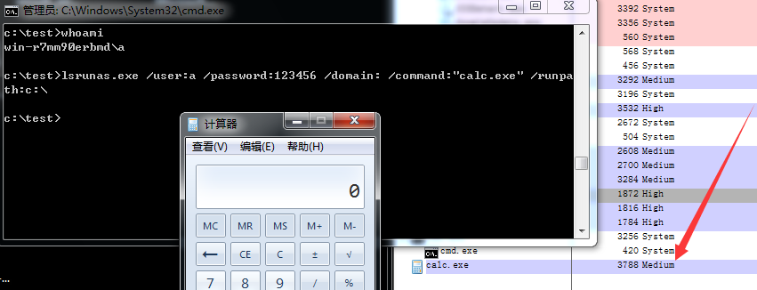


其它第三方工具类似，不需要多说明


### 2.1 system权限下的降权

通过runas lsrunas等方式降权，均会启动失败。这里推荐使用进程注入的方式。
如下图所示，在cobaltstrike获取了system权限的情况下。进入进程列表，选定普通用户权限的进程，执行进程注入

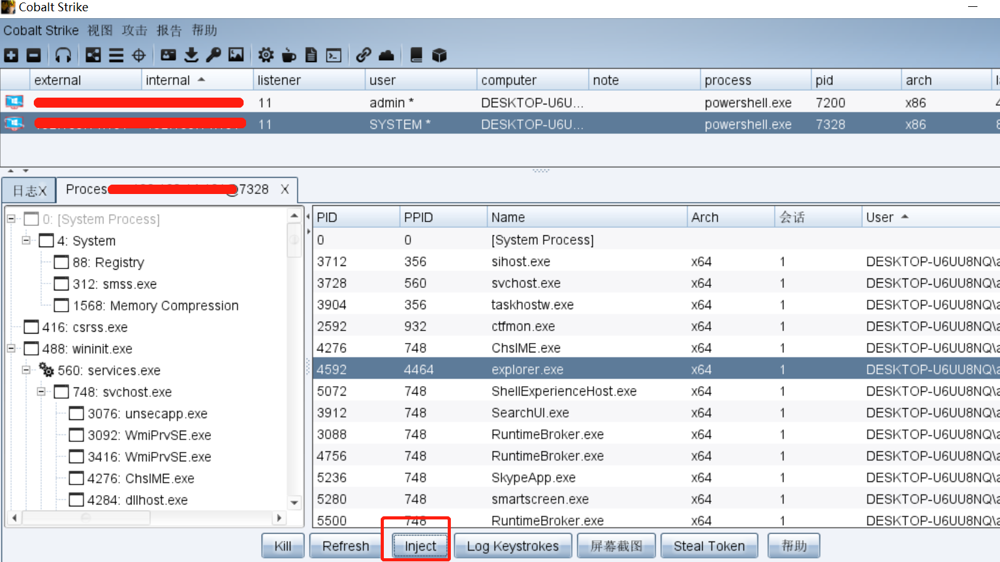

通过工具SelectMyParent，指定进程pid，执行相应的命令。
使用步骤：

1、获取进程winlogon.exe的pid

2、启动SelectMyParent

参数如下：

SelectMyParent.exe calc.exe 504

显示calc.exe为winlogon.exe的子进程，如下图

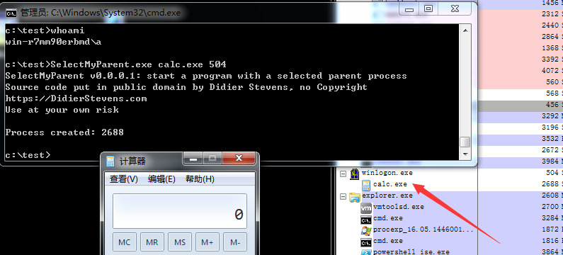

工具地址：
https://github.com/koeracomp5/engine3/blob/6c86b5c71933287e2c123c2a4630044006882f00/27env/Scripts/SelectMyParent.py

https://github.com/3gstudent/From-System-authority-to-Medium-authority/blob/master/SelectMyParent.cpp


## 2.从Admin权限切换到System

### 2.1 通过psexec
以system权限启动：

psexec.exe -accepteula -s -d notepad.exe

默认情况下，system权限的进程不会在用户桌面显示，如果需要显示进程界面，可以加/i参数，命令如下：

psexec.exe -accepteula -s -i -d notepad.exe

如下图
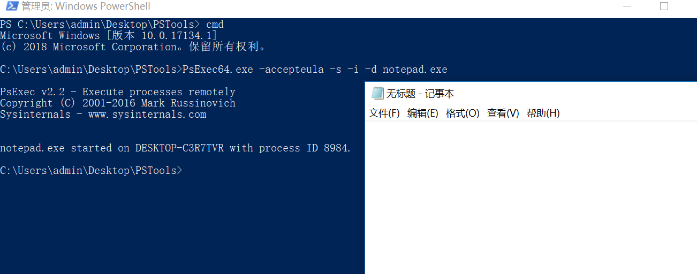

### 2.2 通过计划任务

使用schtasks命令：

创建服务，以system权限启动：

`schtasks /Create /TN Test1 /SC DAILY /ST 10:36 /TR notepad.exe /RU SYSTEM`

查看服务状态：

`schtasks /Query /TN Test1`

删除服务：

`schtasks /Delete /TN Test1 /F`

### 2.3 通过cobaltstrike

获取了管理员权限的用户后，利用cobaltstrike内置的psexec/psexec_psh/winrm。
其中psexec_psh类似psexec命令，使用powershell作为payload，该payload不写入磁盘
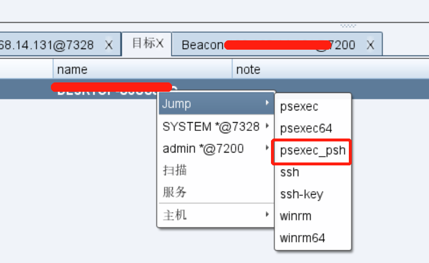

### 2.4 利用token复制
通过复制system权限的token，使进程获得system权限，常用工具如下：

incognito

列举token：`incognito.exe list_tokens -u`
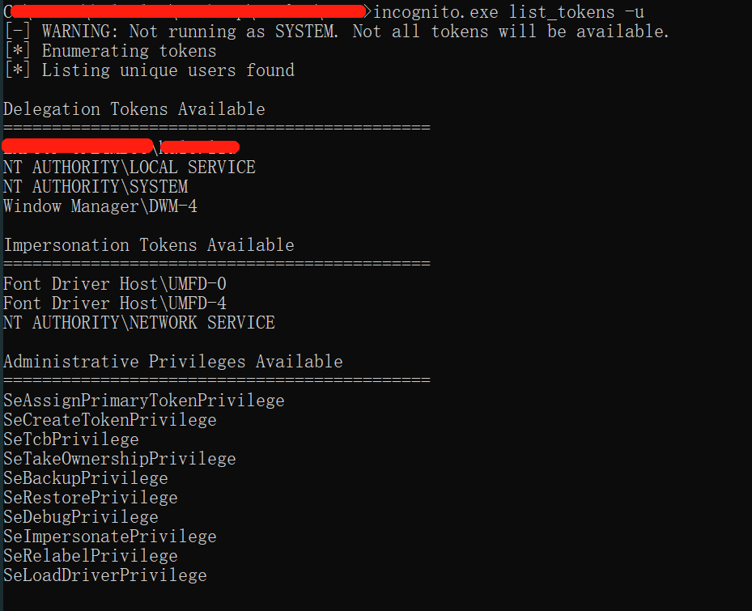

复制token：`incognito.exe execute [options] <token> <command>`
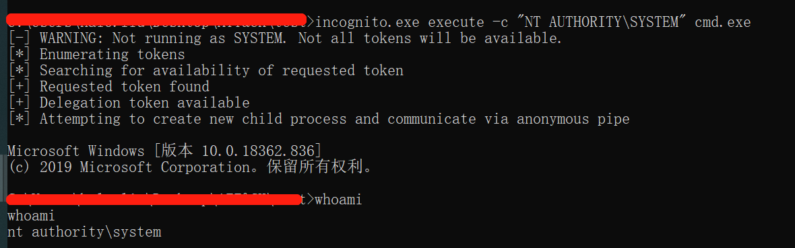

下载地址：

https://labs.mwrinfosecurity.com/assets/BlogFiles/incognito2.zip


## 3.Windows Token操纵权限

Windows有两种类型的Token：

- Delegation token(授权令牌):用于交互会话登录(例如本地用户直接登录、远程桌面登录)
- Impersonation token(模拟令牌):用于非交互登录(利用net use访问共享文件夹)

两种token只在系统重启后清除。具有Delegation token的用户在注销后，该Token将变成Impersonation token，依旧有效

### 3.1 Token窃取
通过模拟或修改正在执行的进程中具有适当权限级别的身份验证令牌来工作。

incognito
列举token：`incognito.exe list_tokens -u`


复制token：`incognito.exe execute [options] <token> <command>`


### 3.2 Potato系列

#### 3.2.1 Hot Potato
在Windows操作系统的默认配置下，Hot Potato（也被称为Potato）能够利用NTLM relay（特别是HTTP->SMB relay）和NBNS协议欺骗。

**本地NBNS欺骗**
NBNS是一个广播UDP协议，可在Windows环境中常用的名称解析。在渗透测试过程中，提前获知目标主机（在这种情况下，我们的目标是127.0.0.1）并发送NBNS查询，就可以制作一个信号并使其淹没在目标主机与NBNS响应（因为它是一个UDP协议）。

**伪造WPAD代理服务器**
WPAD(Web Proxy Auto-Discovery Protocol)是 Web 代理自动发现协议的简称，该协议的功能是可以使局域网中用户的浏览器可以自动发现内网中的代理服务器，并使用已发现的代理服务器连接互联网或者企业内网。
IE浏览器在默认配置下会通过URL:"http://wpad/wpad.dat"来自动尝试检测网络代理。而且Windows中的一些服务也会采用这一机制，例如Windows Update，而且这似乎是Windows的一种版本依赖。

**HTTP -> SMB HTLM Relay**
与所有的HTTP流量，现在流经我们控制的服务器上，我们可以用来要求NTLM身份验证！ 
在Potato的exploit中，所有的请求都以302重定向到的 "http://localhost/GETHASHESxxxxx" ，其中xxxxx是一些独特的标识符。请求 "http://localhost/GETHASHESxxxxx" 会401响应要求NTLM身份验证。 
在NTLM凭据传递到本地的SMB监听器，会创建一个新的系统服务，运行你定义的命令，此命令将以 "NT AUTHORITY \ SYSTEM" 权限运行。

**漏洞利用**
1.Windows 7

`Potato.exe -ip <local ip> -cmd <command to run> -disable_exhaust true`

这将执行NBNS欺骗攻击，欺骗 "WPAD" 解析到127.0.0.1，然后检查Windows Defender更新。 

2.Windows Server 2008

`Potato.exe -ip <local ip> -cmd <command to run> -disable_exhaust true -disable_defender true --spoof_host WPAD.EMC.LOCAL` 

3.Windows 8/10, Server 2012

`Potato.exe -ip <local ip> -cmd <cmd to run> -disable_exhaust true -disable_defender true`

**总结**
修改了IE的配置为自动检测
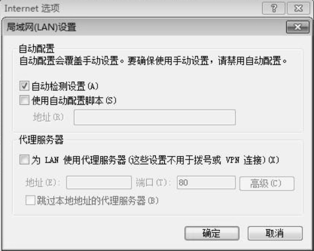

测试主机为win10系统，启动hot potato后。ping wpad找不到地址，NBNS欺骗未成功。尚未发现无法复现的原因


#### 3.2.2 Juicy Potato
Juicy Potato是在工具RottenPotatoNG的基础上做了扩展，适用条件更广。

利用的前提是获得了SeImpersonate或者SeAssignPrimaryToken权限。通常在获取本地服务执行权限的前提下，如webshell。

Juicy Potato的下载地址：`https://github.com/ohpe/juicy-potato`

**限制条件**
- 需要支持SeImpersonate或者SeAssignPrimaryToken权限
- 开启DCOM
- 本地支持RPC或者远程服务器支持PRC并能成功登录
- 能够找到可用的COM对象

**实现方式**

首先确保当前用户支持SeImpersonate或者SeAssignPrimaryToken权限

**1) 加载COM，发出请求，权限为System**
在指定ip和端口的位置尝试加载一个COM对象。RottenPotatoNG使用的COM对象为BITS，CLSID为{4991d34b-80a1-4291-83b6-3328366b9097}

可供选择的COM对象不唯一，Juicy Potato提供了多个，详细列表可参考如下地址：
`https://github.com/ohpe/juicy-potato/blob/master/CLSID/README.md`

**2) 回应步骤1的请求，发起NTLM认证**
正常情况下，由于权限不足，当前权限不是System，无法认证成功

**3) 针对本地端口，同样发起NTLM认证，权限为当前用户**
由于权限为当前用户，所以NTLM认证能够成功完。RottenPotatoNG使用的135端口

Juicy Potato支持指定任意本地端口，但是RPC一般默认为135端口，很少被修改

**4) 分别拦截两个NTLM认证的数据包，替换数据，通过NTLM重放使得步骤1(权限为System)的NTLM认证通过，获得System权限的Token**
重放时需要注意NTLM认证的NTLM Server Challenge不同，需要修正

**5) 利用System权限的Token创建新进程**
如果开启SeImpersonate权限，调用CreateProcessWithToken，传入System权限的Token，创建的进程为System权限
如果开启SeAssignPrimaryToken权限，调用CreateProcessAsUser，传入System权限的Token，创建的进程为System权限

**漏洞利用**
通过上传webshell控制主机，执行 `whoami /priv`查看当前权限
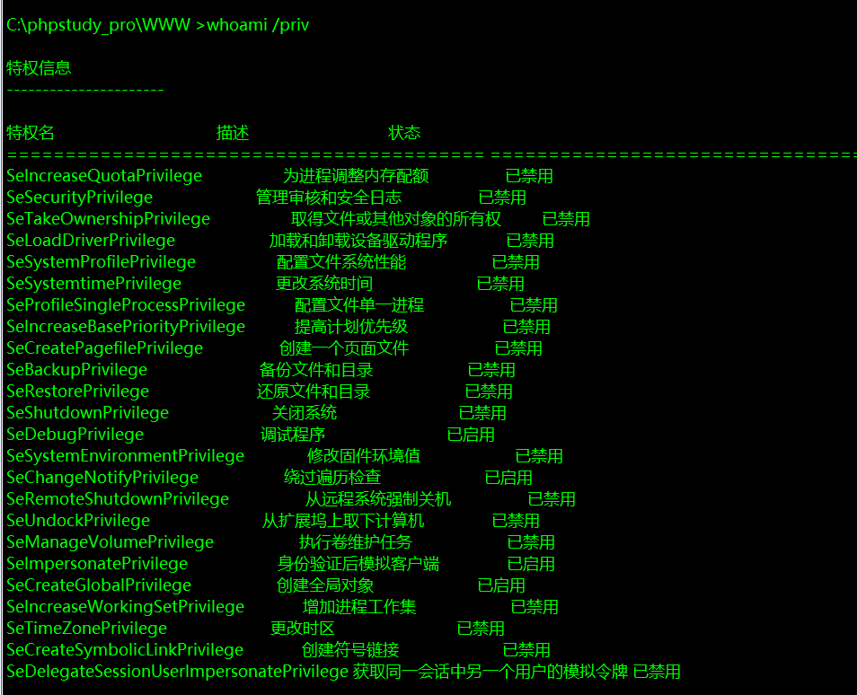
```
T:\>JuicyPotato.exe
JuicyPotato v0.1

Mandatory args:
-t createprocess调用: <t> CreateProcessWithTokenW, <u> CreateProcessAsUser, <*> try both
-p <program>: 运行程序
-l <port>: COM服务器侦听端口


Optional args:
-m <ip>: COM服务器侦听地址 (默认 127.0.0.1)
-a <argument>: 传递给程序命令行参数 (默认 NULL)
-k <ip>: RPC服务器IP地址 (default 127.0.0.1)
-n <port>: RPC服务器侦听端口 (default 135)
-c <{clsid}>: CLSID (default BITS:{4991d34b-80a1-4291-83b6-3328366b9097})
-z 仅测试CLSID并打印令牌的用户
```
执行如下命令，使用默认的CLSID。创建进程成功

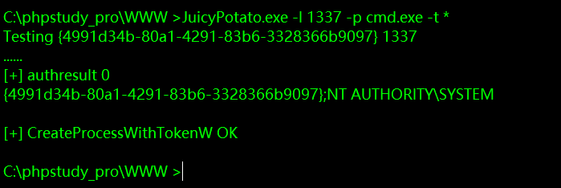

获取具有system权限的cmd窗口

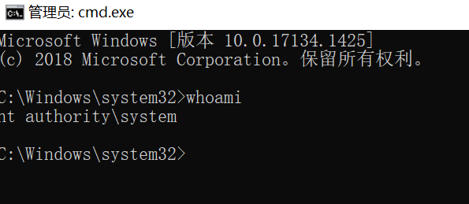


#### 3.2.3 pipePotato

**影响**
对于任意windows Server 2012以上的windows server版本(win8以上的某些windows版本也行)，从Service用户提升到System。

**实现方式**
spoolsv.exe进程会注册一个 rpc 服务,任何授权用户可以访问该进程,同时攻击者可以利用Server names规范问题注册一个命名管道,而同时System用户访问该管道的时候，我们就可以模拟该token创建一个System权限的进程。

**漏洞利用**

工具地址：
https://github.com/BeichenDream/BadPotato
https://github.com/daikerSec/pipePotato

在apache搭建的服务器上，上传webshell。上传编译好的BadPotato程序，执行如下命令：
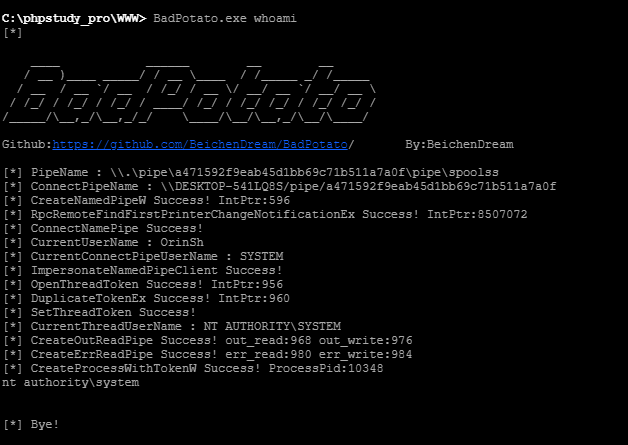


### 3.3 九种Token权限操纵
需要考虑的9种权限如下：
- SeImpersonatePrivilege
- SeAssignPrimaryPrivilege
- SeTcbPrivilege
- SeBackupPrivilege
- SeRestorePrivilege
- SeCreateTokenPrivilege
- SeLoadDriverPrivilege
- SeTakeOwnershipPrivilege
- SeDebugPrivilege

通过命令 `whoami /priv` 查看当前权限，如下所示
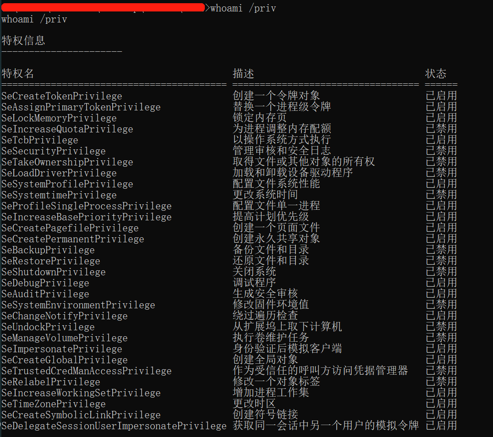

通常情况下，普通用户不会拥有上述的九种特权。
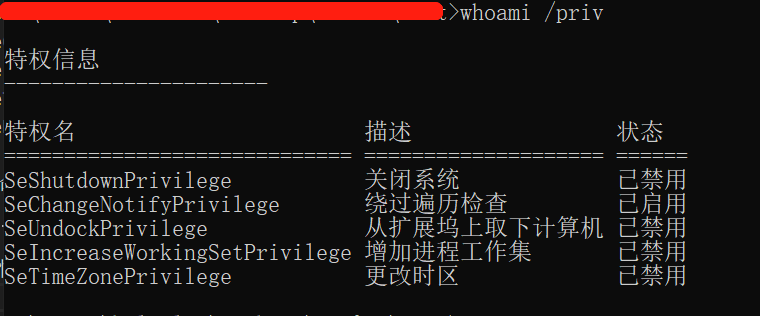

只有本地开启的应用服务，才会拥有特殊权限。例如上传webshell，以IIS用户的服务查看权限

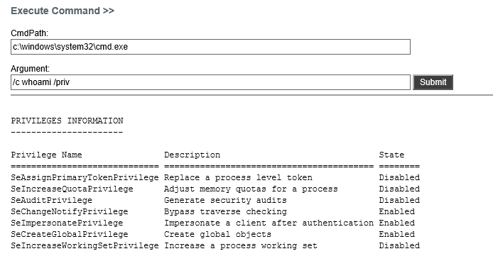


#### 3.3.1 SeImpersonatePrivilege权限的利用思路
身份验证后模拟客户端(Impersonatea client after authentication)，拥有该权限的进程能够模拟已有的token，但不能创建新的token。

该用户具有该权限：

- 本地管理员组成员和本地服务帐户
- 由服务控制管理器启动的服务
- 由组件对象模型 (COM) 基础结构启动的并配置为在特定帐户下运行的COM服务器

**利用思路**
1. 利用NTLM Relay to Local Negotiation获得System用户的Token 可使用开源工具Rotten Potato、lonelypotato或者Juicy Potato
2. 通过WinAPI CreateProcessWithToken创建新进程，传入System用户的Token 具有SeImpersonatePrivilege权限才能创建成功
3. Token具有System权限

可供参考的测试代码：
- https://github.com/hatRiot/token-priv/blob/master/poptoke/poptoke/SeImpersonatePrivilege.cpp
- https://github.com/3gstudent/Homework-of-C-Language/blob/master/EnableSeImpersonatePrivilege.cpp

代码实现了开启当前进程的SeImpersonatePrivilege权限，调用CreateProcessWithToken，传入当前进程的Token，创建一个进程，配合RottenPotato，可用来从LocalService提权至System权限

#### 3.3.2 SeAssignPrimaryPrivilege权限的利用思路
向进程(新创建或者挂起的进程)分配token

通常，iis或者sqlserver用户具有该权限

**思路1**
1.利用NTLM Relay to Local Negotiation获得System用户的Token
2.通过WinAPI CreateProcessAsUser创建新进程，传入System用户的Token
3.Token具有System权限

可供参考的测试代码：
- https://github.com/hatRiot/token-priv/blob/master/poptoke/poptoke/SeAssignPrimaryTokenPrivilege.cpp
- https://github.com/3gstudent/Homework-of-C-Language/blob/master/EnableSeAssignPrimaryTokenPrivilege.cpp

代码实现了开启当前进程的SeAssignPrimaryTokenPrivilege权限，调用CreateProcessAsUser，传入当前进程的Token，创建一个进程，配合RottenPotato，可用来从LocalService提权至System权限

**思路2**

1.利用NTLM Relay to Local Negotiation获得System用户的Token
2.通过WinAPI CreateProcess创建一个挂起的新进程，参数设置为CREATE_SUSPENDED
3.通过WinAPI NtSetInformationProcess将新进程的Token替换为System用户的Token
4.Token具有System权限


#### 3.3.3 SeTcbPrivilege权限的利用思路
等同于获得了系统的最高权限

**利用思路**
1.调用LsaLogonUser获得Token
2.将该Token添加至Local System account组
3.该Token具有System权限

可供参考的测试代码：
- https://github.com/hatRiot/token-priv/blob/master/poptoke/poptoke/SeTcbPrivilege.cpp
- https://github.com/3gstudent/Homework-of-C-Language/blob/master/EnableSeTcbPrivilege.cpp

代码实现了开启当前进程的SeTcbPrivilege权限，登录用户test1,将其添加至Local System account组，获得System权限，创建注册表项HKEY_LOCAL_MACHINE\SOFTWARE\testtcb

#### 3.3.4 SeBackupPrivilege权限的利用思路
用来实现备份操作，对当前系统任意文件具有读权限

**利用思路**
1.读取注册表HKEY_LOCAL_MACHINE\SAM、HKEY_LOCAL_MACHINE\SECURITY和HKEY_LOCAL_MACHINE\SYSTEM
2.导出当前系统的所有用户hash mimikatz的命令如下：`lsadump::sam /sam:SamBkup.hiv /system:SystemBkup.hiv`

可供参考的测试代码：
- https://github.com/hatRiot/token-priv/blob/master/poptoke/poptoke/SeBackupPrivilege.cpp
- https://github.com/3gstudent/Homework-of-C-Language/blob/master/EnableSeBackupPrivilege.cpp

代码实现了开启当前进程的SeBackupPrivilege权限，读取注册表，将其保存成文件C:\\test\\SAM、C:\\test\\SECURITY和C:\\test\\SYSTEM

#### 3.3.5 SeRestorePrivilege权限的利用思路

用来实现恢复操作，对当前系统任意文件具有写权限

**思路1**
1.获得SeRestorePrivilege权限，修改注册表HKLM\SOFTWARE\Microsoft\Windows NT\CurrentVersion\Image File Execution Options
2.劫持exe文件的启动
3.实现提权或是作为后门

**思路2**
1.获得SeRestorePrivilege权限，向任意路径写入dll文件
2.实现dll劫持
3.实现提权或是作为后门

可供参考的测试代码：
- https://github.com/hatRiot/token-priv/blob/master/poptoke/poptoke/SeRestorePrivilege.cpp
- https://github.com/3gstudent/Homework-of-C-Language/blob/master/EnableSeRestorePrivilege.cpp

代码实现了开启当前进程的SeRestorePrivilege权限，创建注册表项HKEY_LOCAL_MACHINE\SOFTWARE\testrestore

#### 3.3.6 SeCreateTokenPrivilege权限的利用思路

用来创建Primary Token

**利用思路**
1.通过WinAPI ZwCreateToken创建Primary Token
2.将Token添加至local administrator组
3.Token具有System权限

可供参考的测试代码：
- https://github.com/hatRiot/token-priv/blob/master/poptoke/poptoke/SeCreateTokenPrivilege.cpp
- https://github.com/3gstudent/Homework-of-C-Language/blob/master/EnableSeCreateTokenPrivilege.cpp

代码实现了开启当前进程的SeCreateTokenPrivilege权限，创建Primary Token，将其添加至local administrator组，开启SeDebugPrivilege和SeTcbPrivilege权限

#### 3.3.7 SeLoadDriverPrivilege权限的利用思路

用来加载驱动文件

**利用思路**
1.创建驱动文件的注册表
```
reg add hkcu\System\CurrentControlSet\CAPCOM /v ImagePath /t REG_SZ /d "\??\C:\test\Capcom.sys"
reg add hkcu\System\CurrentControlSet\CAPCOM /v Type /t REG_DWORD /d 1
```
2.加载驱动文件Capcom.sys
3.Capcom.sys存在漏洞，系统加载后，可从普通用户权限提升至System权限，利用代码可参考： https://github.com/tandasat/ExploitCapcom
4.获得System权限

可供参考的测试代码：
- https://github.com/hatRiot/token-priv/blob/master/poptoke/poptoke/SeLoadDriver.cpp 
- https://github.com/3gstudent/Homework-of-C-Language/blob/master/EnableSeLoadDriverPrivilege.cpp

代码实现了开启当前进程的SeLoadDriverPrivilege权限，读取注册表项hkcu\System\CurrentControlSet\CAPCOM，加载驱动文件Capcom.sys

#### 3.3.8 SeTakeOwnershipPrivilege权限的利用思路
同SeRestorePrivilege类似，对当前系统任意文件具有写权限

**思路1**
1.获得SeTakeOwnershipPrivilege权限，修改注册表`HKLM\SOFTWARE\Microsoft\Windows NT\CurrentVersion\Image File Execution Options`
2.劫持exe文件的启动
3.实现提权或是作为后门

**思路2**
1.获得SeTakeOwnershipPrivilege权限，向任意路径写入dll文件
2.实现dll劫持
3.实现提权或是作为后门

可供参考的测试代码：
- https://github.com/hatRiot/token-priv/blob/master/poptoke/poptoke/SeTakeOwnershipPrivilege.cpp
- https://github.com/3gstudent/Homework-of-C-Language/blob/master/EnableSeTakeOwnershipPrivilege.cpp

代码实现了开启当前进程的SeTakeOwnershipPrivilege权限，修改注册表项hklm\SOFTWARE\Microsoft\Windows NT\CurrentVersion\Image File Execution Options的权限，普通用户权限对其具有完整操作权限

后续的写操作：
```
reg add "hklm\SOFTWARE\Microsoft\Windows NT\CurrentVersion\Image File Execution Options" /v takeownership /t REG_SZ /d "C:\\Windows\\System32\\calc.exe"
```

#### 3.3.9 SeDebugPrivilege权限的利用思路
用来调试指定进程，包括读写内存，常用作实现dll注入

**利用思路**
1.找到System权限的进程
2.dll注入
3.获得System权限

可供参考的测试代码：
https://github.com/3gstudent/Homework-of-C-Language/blob/master/EnableSeDebugPrivilege.cpp

代码实现了开启当前进程的SeDebugPrivilege权限，向指定进程注入dll